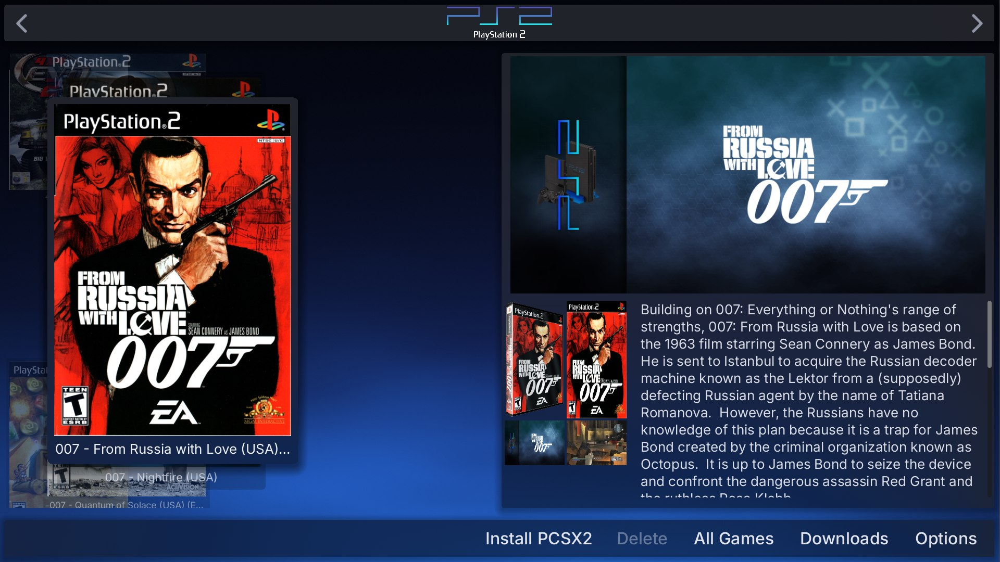
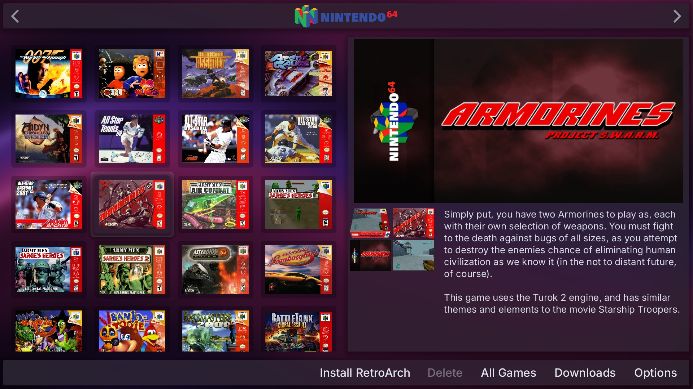
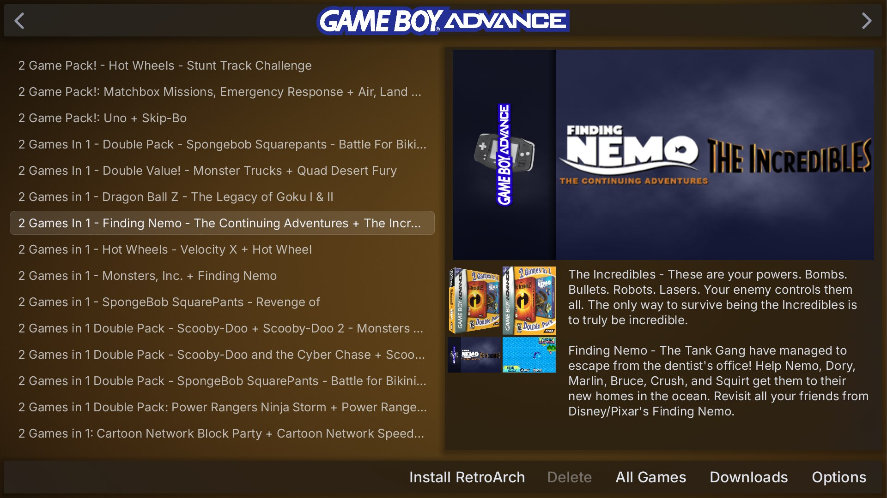

# RomM Frontend

A couch-friendly client for [RomM](https://github.com/rommapp/romm). Browse your RomM library
with a controller, download a game, and play it. The emulator is installed and set up for you,
and your saves sync back to RomM.

| Grid view | List view |
|---|---|
|  |  |

## Contents

- [Install](#install)
- [First launch](#first-launch)
- [Controls](#controls)
- [Playing games](#playing-games)
- [Saves and BIOS](#saves-and-bios)
- [Netplay](#netplay)
- [Controllers](#controllers)
- [Settings](#settings)
- [Files](#files)
- [Troubleshooting](#troubleshooting)

## Install

You need a RomM server and a 64-bit PC running Windows 10/11 or Linux.

1. Download `romm-frontend-windows.zip` or `romm-frontend-linux.zip` from
   [Releases](https://github.com/HowDoDownhill/romm-frontend/releases/latest).
2. Extract it to any folder you can write to. The app is portable: everything it downloads
   stays in that folder.
3. Run `romm-frontend.exe` on Windows or `romm-frontend.sh` on Linux.

Nothing else needs installing. Updates are offered in the app when a new release is out.

## First launch

Enter your server details:

- **Server Address**: the full URL, such as `https://romm.example.com` or `http://192.168.1.50:8080`.
- **Username** and **Password**: your RomM login.
- **API Key**: create one in RomM under your profile, then **Client API Tokens**.

They are saved for next time. Your library, cover art and BIOS files then download in the
background.

## Controls

Button names follow an Xbox controller. The bar at the bottom of the screen always shows what
each button does right now.

| Action | Controller | Keyboard |
|---|---|---|
| Move | D-pad or left stick | Arrow keys |
| Play, download or confirm | A | Enter |
| Back | B | Escape (in menus) |
| Previous or next system | LB or RB | Page Up or Page Down |
| Pick a system from a list | Hold LB or RB | |
| Jump to the next letter | Left or Right (carousel and list views) | Left or Right |
| Show installed games only | B | |
| Downloads | Y | Backspace |
| Delete a downloaded game | X | Delete |
| Start menu | Start | Escape (from the game list) |
| Switch between systems and collections | View | Tab |
| Search | Type while the game list is selected | |
| Close a running emulator | Hold View for 2 seconds | |

The mouse works too: click a game to select it and double-click to play it.

## Playing games

Select a game and press **A**. The first press does whatever is needed next: install the
emulator, download the game, then play it. Progress shows on the Downloads page (**Y**).

To leave a game, hold **View** for two seconds. You can change this combination in
**Settings > Input Settings**.

The **Start** menu holds everything else for the selected game: favorites, the system's
emulator and BIOS, netplay, controller assignment, a random game, and settings.

## Saves and BIOS

**Saves** sync with RomM automatically. Before a game starts, any newer save on the server is
downloaded; when the emulator closes, changed saves are uploaded. All saves live in the `saves`
folder, so reinstalling an emulator never touches them and one folder is your whole backup.

**BIOS files** are downloaded from RomM's firmware section. If a system has more than one,
choose it from **Start > Select Bios For Emulator**.

## Netplay

Play a game together with someone running RomM Frontend on another PC.

1. The host selects a game and chooses **Start > Host Session**. A join code is copied to the
   clipboard; send it to the other players.
2. Each player copies the code and chooses **Start > Join Session**. Players on the same network
   are found automatically without a code.
3. The lobby checks that everyone has the game and the right emulator, then the host starts
   the game for everyone.

Netplay works on systems run by RetroArch and on Dreamcast (Flycast). Over the internet, the
host's router needs UPnP turned on.

## Controllers

Any controller your PC recognises works in the app. For games:

- **Windows**: the app offers, once, to install a small driver (Automatic Controller Mapping). With it, every emulator sees the same virtual Xbox controller, whatever you are
  holding, and you set player order by pressing a button on each pad
  (**Start > Assign Controllers**).
- **Linux**: emulators use your controller directly. Xbox-style pads work without setup.
- **Wii** games use real Wii Remotes over Bluetooth. Press 1+2 on the remote while the game runs.

## Settings

Open **Start > Settings**.

- **Game List Settings**: Carousel, Grid or List view, hiding games without cover art, and
  showing empty systems.
- **General Settings**: app theme, background style, interface size (useful on a TV or a
  handheld), and on Windows a preference for the dedicated GPU.
- **Input Settings**: the combination that closes an emulator and how long to hold it, and on
  Windows the Automatic Controller Mapping switch.
- **Each system**: which emulator it uses and that emulator's options, such as resolution or,
  for RetroArch, the core.

## Files

Everything lives in the app folder.

| Folder | Contents |
|---|---|
| `roms` | Downloaded games |
| `saves` | All saves, one folder per emulator |
| `bios` | BIOS and firmware |
| `emulators` | Installed emulators |
| `config.cfg` | Your settings and login. It holds your password in plain text, so keep it private. |

To move games, saves, BIOS or emulators to another drive, see
[Advanced configuration](docs/ADVANCED.md).

## Troubleshooting

- **Can't log in**: check the server address includes `http://` or `https://` and the port,
  and that the API key is still valid in RomM.
- **A game won't start**: open the system's settings and try reinstalling its emulator, or pick
  a different one. Some systems (PS1, PS2) need a BIOS file in RomM's firmware section.
- **Wrong buttons in a game**: on Windows, turn on **Automatic Controller Mapping** in
  **Settings > Input Settings**.
- **Report a problem**: open an
  [issue](https://github.com/HowDoDownhill/romm-frontend/issues) and include
  `romm-frontend.console.exe` output on Windows, or the terminal output of `romm-frontend.sh`
  on Linux.

## For emulator authors and tinkerers

[Advanced configuration](docs/ADVANCED.md) covers `config.cfg`, choosing emulators per system,
adding a new emulator, and its settings.
